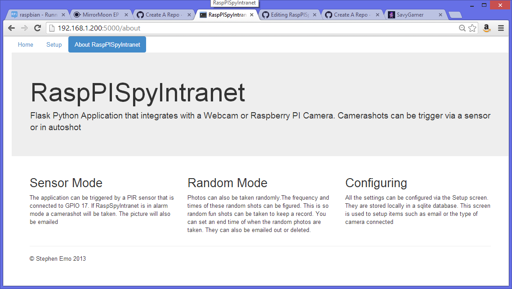

RaspPISpyIntranet
=================

Python Flask Application that takes Photos via USB Cam or Camera Module. Takes Random Photos and PIR Triggered photos

This is a Python Flask Application that supports connecting a PIR Sensor to GPIO17. Once this is done the Raspberry PI can detect when
someone is close to it. A USB Web Cam or Raspberry PI camera module can be connected and a shot will be taken and emailed to the user.

So that this is not too sinister an application the RaspPISpyIntranet can be set to take random shots, you can choose the frequency 
and start and end time of these snaps so you know when the application is not watching. The idea is that you get a journal of photos taken in your house.

My Raspberry PI sits in front of the TV as a YouTube machine so it also now takes random snaps and works as an alarm when I am away,

Shell Setup scripts

The shell scripts assumes that the application is run from home/pi/RaspPIPyIntranet. It ca  be edited. Follow the 
below steps to ensure the application runs at bootup.

sudo cp RaspPIPyIntranet.sh /etc/init.d
cd /etc/init.d
chmod 755 /etc/init.d/RaspPIPyIntranet.sh
sudo update-rc.d RaspPIPyIntranet.sh defaults 

Permissions
As the application accesses the GPIO port it will need to run as sudo. I will put together a Flask Distribute Package but if you are
installing manually you will need to do the following pip installs as sudo

sudo pip install flask
sudo pip install wtforms
sudo pip install apscheduler

sqlite3 will need to be installed as all the configuration is stored on the local sqlite database

